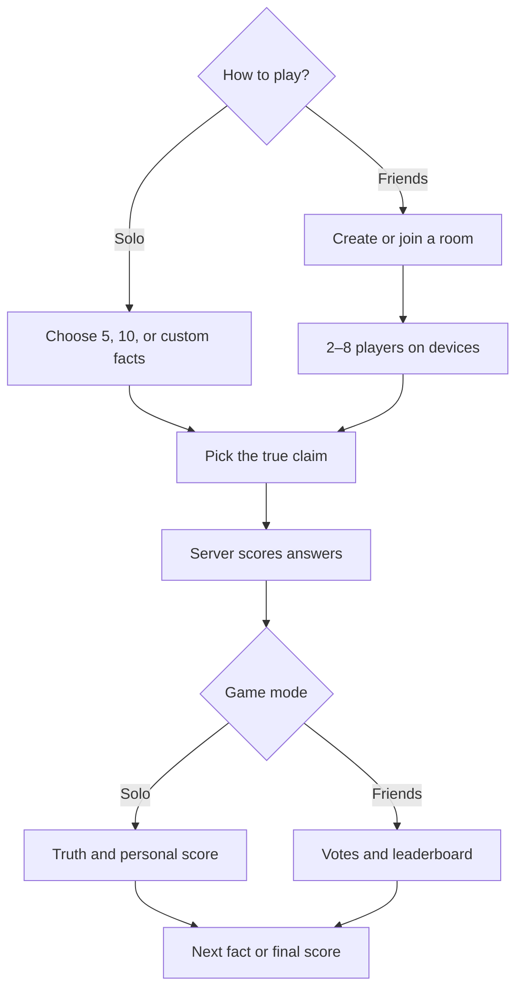
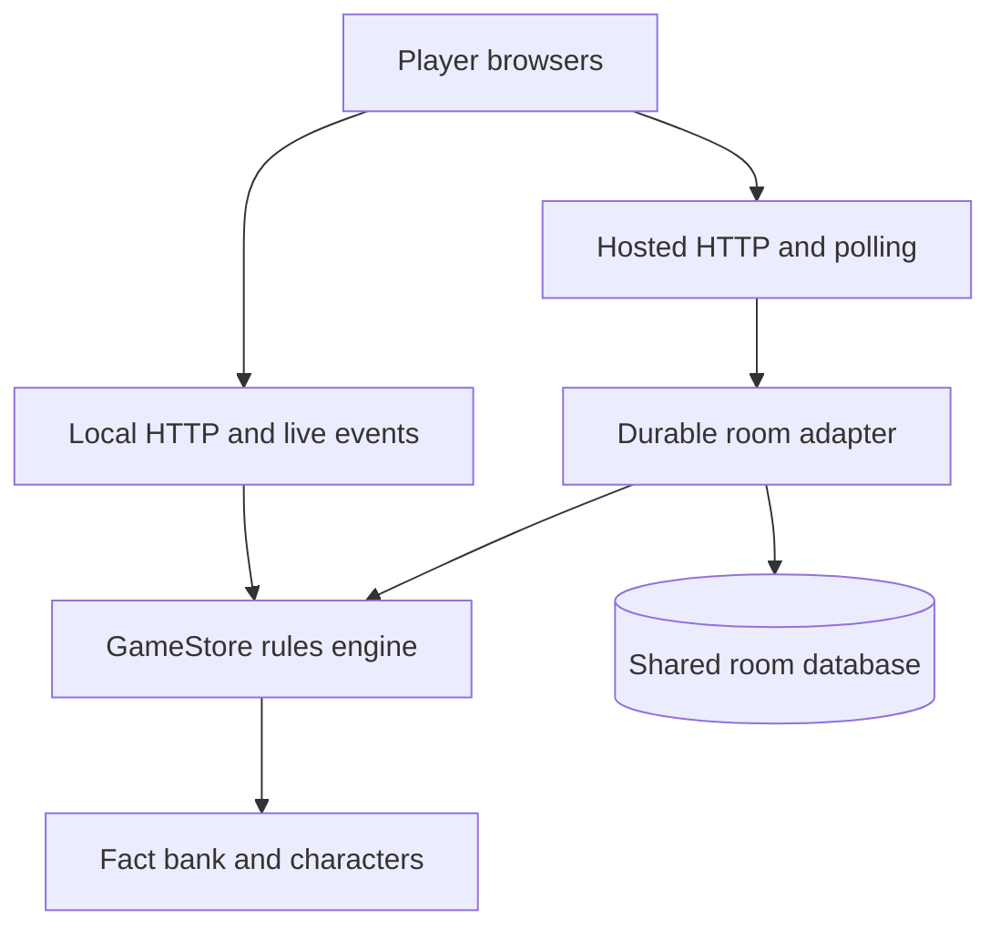

# Oddly True

A bizarre-fact trivia game to play alone or with **2–8 friends** across devices. Each round presents three claims. Exactly one is true.

**[Play the live game](https://oddly-true.oddlytrue-play.workers.dev)** · [Architecture](docs/architecture.md) · [Testing](docs/testing.md) · [API](docs/api.md)

No account is needed. Choose a quick five-fact Solo game, ten facts, or a custom length from 1–10; or create a room, share its five-character code or invite link, and play with friends on separate devices.

## How it works



The browser shows each player's view. The server keeps the room state, enforces the timer and scoring rules, and reveals the true claim only after voting. See the [system architecture and data flow](docs/architecture.md) for the local and hosted paths.

## Project requirements

| Requirement | Implementation | Verification |
| --- | --- | --- |
| At least two players on separate devices | Server-authoritative rooms with 2–8 seats; code/link joining | HTTP and concurrent hosted-room tests; separate-device manual checklist |
| Rules players can follow unaided | In-game How to play, lobby guidance, scoring, timer and results | Game-rule tests and manual onboarding checklist |
| Reachable online | Public game URL above; shared hosted API/database | Public deployment completed; manual cross-device acceptance is a separate check |

## Run locally

Use **Node.js 24** and npm. No account, database, or secret is needed for local play.

```bash
npm ci
npm start
```

Open **http://localhost:3000/oddly-true/**. `npm run open` also opens a browser automatically. Keep the terminal open while playing. On Windows, `start-local.bat` provides the same launcher.

To test two players on one computer, use separate browser profiles or a normal and private window. For two devices on the same Wi-Fi, use the LAN address printed by the server. `localhost` on a phone refers to the phone, not your computer. The public game works across networks.

Local settings are optional shell environment variables, for example `PORT=3001 HOST=127.0.0.1 npm start`. See [.env.example](.env.example). The server does not automatically load a `.env` file.

## How to play

1. **Choose:** select Play Solo or Play with Friends. For friends, the host creates a room and 1–7 friends join by code or link. Choose a preset identity or type a custom name.
2. **Set the length:** Solo offers a quick five facts, a full ten, or a custom 1–10. An optional Auto next setting gives you 15 seconds on each reveal, with Pause and Next now; it starts off. For friends, choose 10 rounds, a custom number from 1–10, or Host decides, up to 10 rounds; then choose Individuals or Teams.
3. **Answer:** choose one claim within 20 seconds. A pick locks immediately. If everyone answers early, the round proceeds early.
4. **Score:** correct earns **+10**; incorrect or timeout earns **0**. Each player has one optional Wild Card per game: **+20** if correct, **−5** if wrong.
5. **Reveal:** Solo shows the truth, explanation, credited image and points immediately after an answer or timeout. Friends see votes first, then the truth, round winner and leaderboard; the host advances.
6. **Finish or continue:** Solo can finish early after any reveal or show your score after the chosen number. In Friends, the host can finish after any reveal, too. At the score screen, Solo or the Friends host can add up to five unseen facts and keep the score, or replay from zero. The highest cumulative score wins; tied players share the win.

**Teams:** available for 4–8 players. Two teams are balanced automatically, with host-controlled swaps in the lobby. Everyone answers independently. Team scores average members' personal scores. The best positive average earned in a round wins that round; the highest cumulative average wins the game. Ties share the win. When nobody earns a positive round score, there is no round winner.

## Implemented features

- Room codes, invite links and token-protected player seats.
- Solo practice with a chosen 1–10 facts and optional, pausable Auto next after each reveal; 2–8-player Individuals/Teams with fixed, custom and host-controlled lengths. Both modes can finish early and extend with up to five unseen facts while keeping scores.
- Locked answers, server-enforced deadlines and once-per-game Wild Cards.
- Personal round/final messages, cumulative leaderboards, reactions and brief celebrations.
- Fourteen preset characters, custom names, creature/theme matching and rerolling.
- Bundled illustrated avatars, a custom pigeon, brief welcome overlays and credited fact photographs.
- Original short sound cues for questions, locked answers, reveals and final scores, with a persistent Sound on/off button. A separate, very soft original background music loop is enabled by default on the landing page and stops during gameplay. Music and sound effects have independent, saved controls. Browsers may wait for the first interaction before playing music. Solo completion uses celebratory (70%+), gentle (20% or less), or steady (between) feedback based on points relative to 10 per fact played; a Wild Card can exceed that baseline.
- Light/dark themes, labelled controls, text feedback and reduced-motion support.
- Same-tab reconnection, replay, and host transfer when leaving between games.

Character matching uses curated words, not AI generation. Trust maps to a dog and Sky to a pigeon; explicit animal names take priority. Unknown names get a repeatable surprise.

## Architecture and folders



Local and hosted play use the same game rules. The hosted path saves rooms in a shared database; the local path keeps them in memory.

| Path | Responsibility |
| --- | --- |
| `public/` | Browser UI, responsive styles, themes and bundled images |
| `shared/personas.js` | Character catalogue and deterministic name matching |
| `server/game.js` | Authoritative rules, scores and game phases |
| `server/questions.js`, `server/questions-extra.js` | Live fact bank, decoys, sources and image credits |
| `server/questions-pending.js` | Drafts held out of play until reviewed in batches |
| `server/index.js` | Local Node HTTP server and server-sent events |
| `server/worker.js` | Hosted HTTP entry point and input boundary |
| `server/hosted.js` | Durable room storage, concurrency and deadline recovery |
| `db/` | Database schema |
| `drizzle/` | Versioned migrations; applied files are immutable |
| `scripts/` | Build, source checks and artwork maintenance |
| `test/` | Rules, API, live-event and concurrency tests |
| `docs/` | Architecture, API, deployment and testing guides |
| `.github/` | CI workflow and issue/PR templates |

The browser displays player-specific snapshots; it never decides correctness or scores. Both server adapters reuse the same rules engine. See [architecture](docs/architecture.md).

## Development commands

| Command | Purpose |
| --- | --- |
| `npm start` | Run the local game |
| `npm run open` | Run and open a browser |
| `npm run dev` | Restart the server on source changes |
| `npm run check` | Check JavaScript syntax |
| `npm test` | Run automated game/API/concurrency tests |
| `npm run test:coverage` | Run tests with Node's coverage report |
| `npm run build` | Build the hosted Worker/browser assets into `dist/` |
| `npm run db:generate` | Generate a migration after a schema change |

GitHub CI installs from the lockfile, checks syntax, tests and builds. Cloudflare builds and deploys changes merged into `main`. See [deployment](docs/deployment.md) and [contributing](CONTRIBUTING.md).

## Data and limitations

Local rooms reset when the local server stops. Hosted rooms use a shared database and survive compatible deployments. They expire after four hours without a state-changing action; expired records are removed during room-creation cleanup. There are no accounts or app-level analytics. Theme, audio and Solo Auto next choices are stored in this browser. See [security/privacy](SECURITY.md).

This is a playable project, not a load-tested commercial service. Solo selects up to ten facts; multiplayer selects up to ten rounds from 56 questions: the original ten, two reviewed batches of 20, and six from the third review. Each new question has a source and a credited representative image. Further drafts are held out of play while their answers, links and images are reviewed in batches. Hosted updates use roughly 900 ms polling. A disconnected multiplayer host cannot be replaced during an active game; reconnect with the same tab or create another room. Accessibility support is implemented but has not undergone a full assistive-technology audit. Manual device/browser checks are documented separately from automated results.

## Credits and reuse

Artwork and fact images retain their own licences and attribution: [THIRD_PARTY_NOTICES.md](THIRD_PARTY_NOTICES.md). No project-wide open-source licence has been assigned to the original application code; third-party terms still apply to their respective assets.
