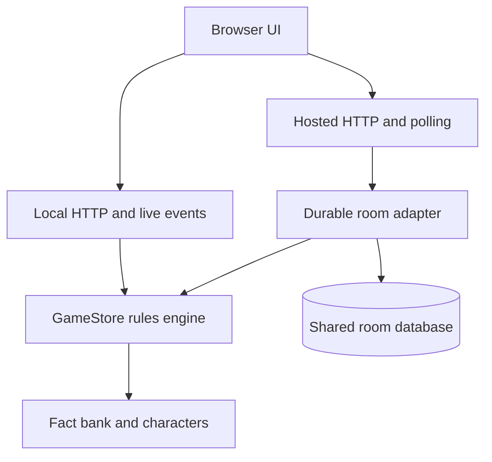
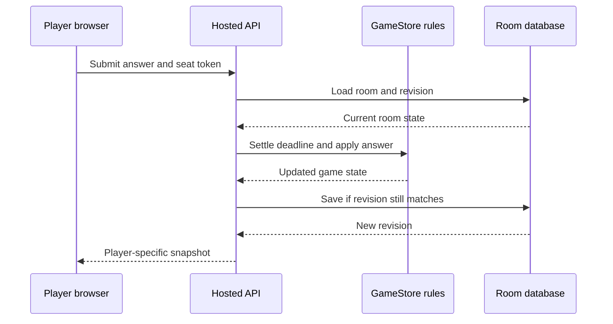
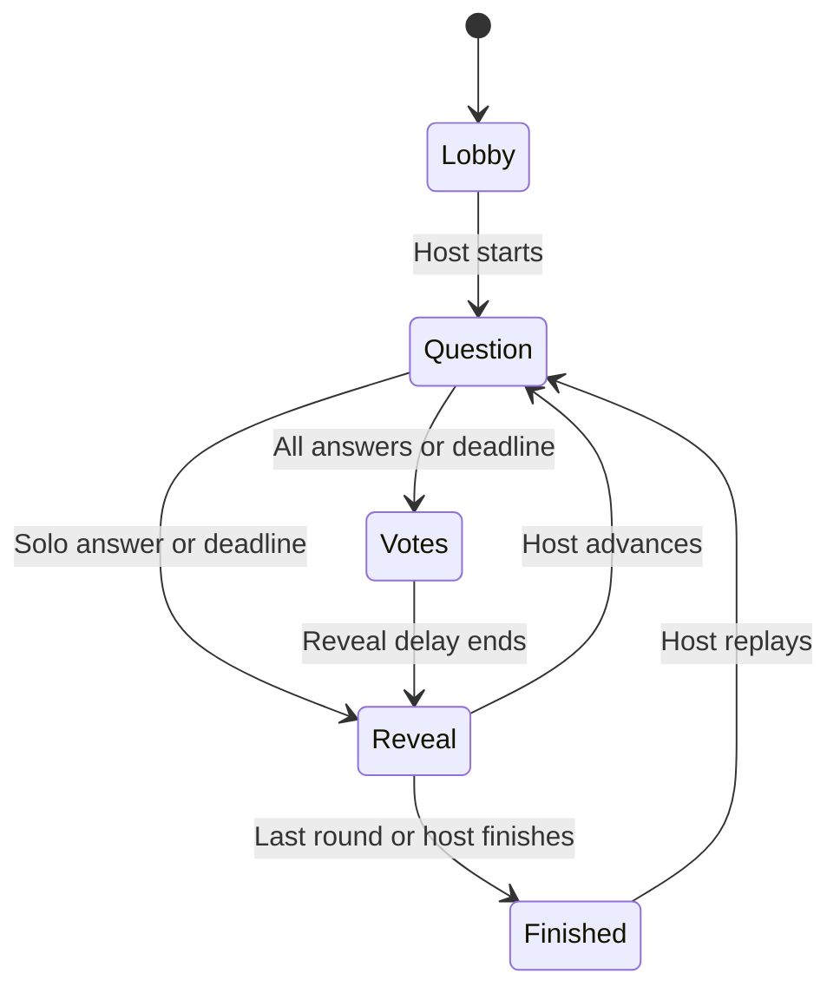

# Architecture

Game rules are separate from network transport and storage. The same rules run locally and online.

## Data flow

The hosted answer path is shown below. The server authenticates the player's seat and owns every game transition; the browser receives only a player-specific snapshot.

If another request saves first, the hosted adapter reloads and retries the action against the newer revision. The hosted browser polls for later snapshots; local play uses the same rules with in-memory rooms and server-sent events instead of the shared database.

## Boundaries

- `public/app.js` handles screens, transient UI choices and room connections. Styling is separate. Vanilla JavaScript suits the current screen count; split screen rendering when added complexity warrants it rather than adding a framework for folder count.
- `server/game.js` owns validation, host permissions, scores and safe snapshots. It has no HTTP/database dependency. `server/questions.js` remains server-only; correct claims are not bundled into browser code.
- `server/index.js` provides local HTTP/SSE. `server/worker.js` provides hosted HTTP. `/api/config` selects the browser transport.
- `server/hosted.js` handles persistence; `db/schema.ts` and `drizzle/` own the schema and migrations.
- `shared/personas.js` is safe shared character data and matching logic, with no secrets.

## Game phases

Early finish requires Host decides mode. Joining/settings are allowed between games. Leaving between games transfers host ownership when needed.
Solo sessions use the same server-owned timer and scoring, but skip the multiplayer vote delay and cannot be joined. Existing rooms without a `kind` field are treated as friends rooms.

## Durable concurrency

A room row stores JSON, a revision and an expiry. A request loads it, authenticates the seat, settles elapsed deadlines, applies an action through `GameStore`, then saves with `UPDATE ... WHERE revision = previous_revision`. A conflicting write retries against fresh state, up to a bounded limit. This prevents simultaneous answers/joins from overwriting one another across server instances. Browser snapshots carry revisions so stale responses can be ignored.

Maps are encoded/revived explicitly; timer handles are never persisted. Hosted rounds use absolute deadlines and catch up on the next request. Local rounds use process timers and SSE. Scoring runs once when entering reveal.

## State and trade-offs

The server is authoritative. `sessionStorage` keeps a tab's seat; `localStorage` keeps the theme. Snapshots omit other seat tokens and hide correct answers until reveal. The source contains the fact bank, so this is casual play rather than an anti-cheat competition.

Polling adds requests and approximately one interval plus network delay to updates. JSON room records keep transitions atomic but are not an analytics model. There is no active-game host takeover or commercial-scale load test. Compatible deployments preserve rooms; changing room-state shape needs explicit compatibility/migration planning.
